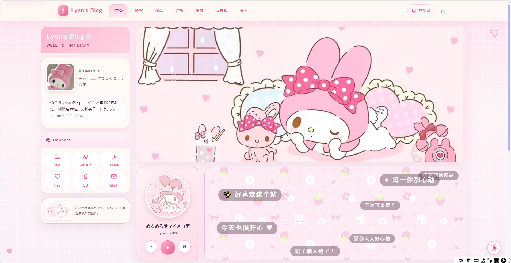
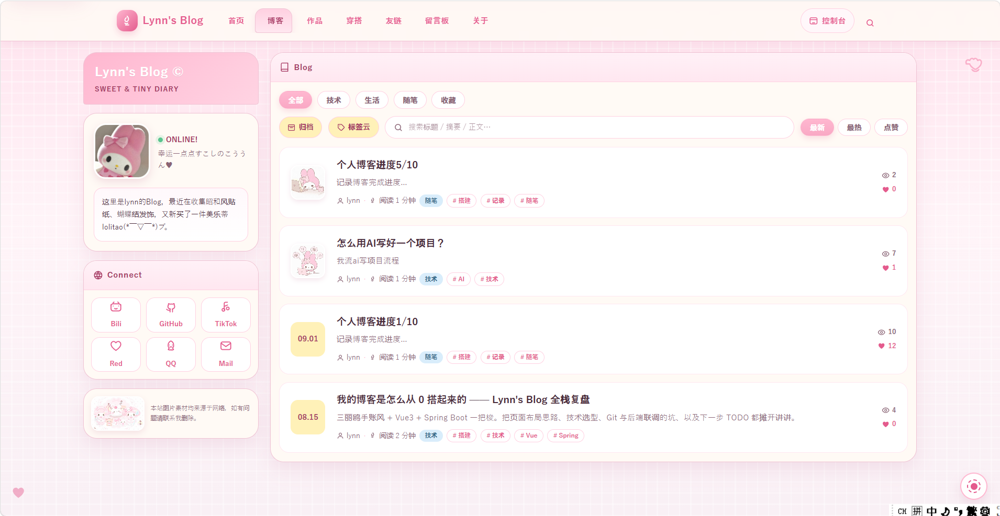
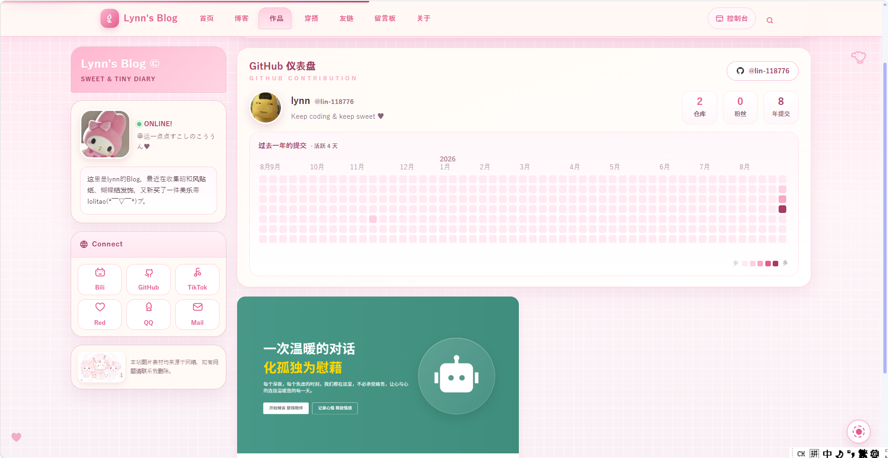
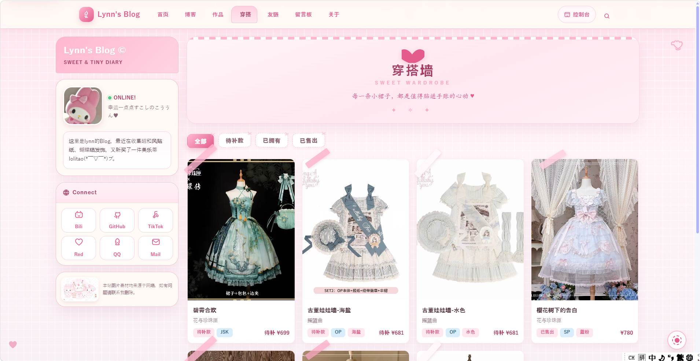
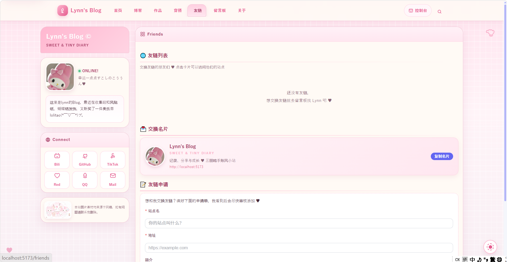

# 🎀 Lynn's Blog

> 三丽鸥粉色手账风的个人博客 —— Vue 3 + Spring Boot 3 全栈自研，把所有"想有一个自己的数字小窝"的想法都实现了一遍。

**在线预览**：[localhost 开发演示](http://localhost:5173) · 作者：[GitHub @lin-118776](https://github.com/lin-118776)

---

## ✨ 功能亮点

### 阅读体验（对标主流开源主题）
- 📑 **文章目录 TOC**：宽屏右侧吸顶目录 + 窄屏折叠目录条，`IntersectionObserver` 滚动高亮、平滑跳转
- ⏱ **字数统计 & 预计阅读时长**：自动剥离 Markdown 语法，中文按 400 字/分估算
- 🏷 **标签系统**：与分类互补的多标签体系，标签云页按热度缩放字号，点击即可筛选
- 🔍 **站内全文搜索**：前端本地索引（标题 ×3 / 摘要 ×2 / 标签 ×2 / 正文 ×1 加权评分），输入即搜、命中词高亮 + 正文片段预览
- 🧩 **相关文章推荐**：同分类优先 + 全站最新补位
- 🗓 **文章归档**：年 → 月时间线，"博客的年轮感"
- 🖼 **图片灯箱**：正文/封面图点击放大，全屏沉浸预览（ESC 关闭）
- 📶 **阅读进度条 & 回到顶部**：顶部 3px 渐变进度 + 右下回顶
- 🎨 **主题换装系统（Design Token）**：全站颜色收敛为 CSS 变量，4 套色板（甜粉 / 薰衣草 / 薄荷 / 柠檬）一键换装并本地持久化——新增主题只需加一组变量，组件零改动
- 😢 **404 可爱页**：保留全站布局的"小纸条被风吹走了"

### 站点内容模块
- 📝 文章（浏览/点赞/评论/上下篇/封面/标签，一人一赞防刷）
- 🗂 分类 · 🏷 标签云 · 🗓 归档 · 🔍 搜索
- 👗 Lolita 穿搭墙：卡片墙 + 分类筛选 + 详情弹窗，管理端完整 CRUD + 穿着次数
- 🔗 友链（申请 → 审核）· 💬 留言板 · 🖼 作品集
- 📔 私密日记本（绝对私有）· 📷 相册/文件管理
- 🎵 首页播放器（单曲循环 + 封面）

### 工程与后台
- 🔐 JWT 登录鉴权（BCrypt 加密），公开接口游客可读、写操作强制登录校验作者归属
- ⚙️ 控制台后台：文章 / 分类 / 友链 / 作品 / 衣橱 / 日记 / 相册全量管理
- 🎨 全站响应式 + 三丽鸥手账视觉（细线条、圆角、奶油底色、贴纸装饰）

## 🧰 技术栈

| 端 | 技术 |
| --- | --- |
| 前端 | Vue 3 · Vite 5 · Vue Router · Pinia 状态(统一登录态) · Element Plus · Axios · md-editor-v3 |
| 后端 | Spring Boot 3.3.4 · MyBatis-Plus · MySQL 8 · JWT · Lombok · 阿里云 OSS（可选） |
| 部署 | Vite proxy 开发联调；后端 8080 / 前端 5173 |

## 📁 目录结构

```
myboke/
├─ frontend/                 # Vue 3 前端
│  └─ src/
│     ├─ components/         # 通用组件（TOC/灯箱/换装/进度条…）
│     ├─ views/              # 页面（Home/Blog/Tags/Archive/Search/…）
│     ├─ views/dashboard/    # 控制台后台管理
│     ├─ utils/              # 文本统计/搜索评分/主题换装等工具
│     └─ api/                # 接口封装
├─ backend/                  # Spring Boot 3 后端
│  ├─ src/main/java/com/example/personalcenter/
│  │  ├─ controller/ service/ mapper/ entity/ dto/
│  │  ├─ interceptor/        # JWT 拦截鉴权
│  │  └─ utils/              # 文件上传 / OSS
│  └─ src/main/resources/application.yml
└─ backend/sql/init.sql      # 建库建表脚本（13 张表）
```

## 🚀 快速启动

环境要求：JDK 17 · Maven 3.8+ · Node 18+ · MySQL 8

```bash
# 1. 初始化数据库（建库 + 13 张表 + 默认分类/联系方式）
mysql -uroot -p < backend/sql/init.sql
#    （或直接执行该 SQL 脚本）

# 2. 启动后端（默认 8080）
cd backend
mvn spring-boot:run

# 3. 启动前端（默认 5173，/api 与 /uploads 自动代理到 8080）
cd frontend
npm install
npm run dev

# 4. 浏览器打开 http://localhost:5173
```

> 数据库连接 / JWT 密钥在 `backend/src/main/resources/application.yml`，生产环境请用环境变量（`DB_HOST / DB_PORT / DB_USERNAME / DB_PASSWORD / JWT_SECRET`）替换。
> 阿里云 OSS 为**可选**（`OSS_ENABLED=false` 默认本地存储），启用时注入 `OSS_ACCESS_KEY / OSS_ACCESS_SECRET` 等环境变量即可，密钥不落盘。

## 🐳 容器化部署（Docker Compose 一键起）

```bash
cp .env.example .env                 # 修改数据库密码与 JWT 密钥
docker compose up -d --build         # 一键启动 MySQL + 后端 + 前端
# 浏览器访问 http://<IP>:8080
```

详细运维 / 公网 / 备案 / 常见问题见 [docs/DEPLOY.md](docs/DEPLOY.md)。

## 📡 主要接口

| 模块 | 前缀 | 说明 |
| --- | --- | --- |
| 认证 | `/api/auth` | 注册 / 登录（JWT） |
| 文章 | `/api/article` | 分页列表（分类/标签/关键字筛选、热度排序）、详情、增删改、点赞、上下篇、相关推荐 |
| 分类 | `/api/category` | 分类 CRUD |
| 评论 | `/api/comment` | 文章评论（biz_type 多态设计） |
| 友链 | `/api/friend` | 公开展示 + 登录管理（申请待审核） |
| 留言 | `/api/guestbook` | 留言板 |
| 作品 | `/api/project` | 作品集 |
| 音乐 | `/api/music` | 首页播放器曲目 |
| 衣橱 | `/api/lolita` | Lolita 服饰收藏 CRUD |
| 日记 | `/api/diary` | 私密日记（仅本人） |
| 文件 | `/api/file` | 图片上传（本地 / OSS） |
| 联系方式 | `/api/contact` | 公开读取、登录后更新 |

## 🖼 页面预览

| 首页 | Blog |
| :---: | :---: |
|  |  |

| 作品（含 GitHub 贡献热力图） | 穿搭墙 | 友链 |
| :---: | :---: | :---: |
|  |  |  |

## 📝 License

MIT © Lynn
